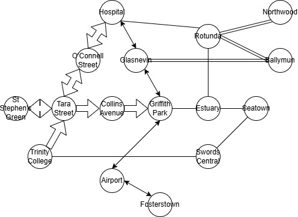

# Exam #1: "Last Race"
## Student: s361881 DISANTO MICHELE

---

## React Client Application Routes

`/`: Pagina delle istruzioni e introduzione al gioco
`/login`: Modulo di autenticazione (reindirizza a `/home` se già loggati) 
`/home`: Area personale: classifica personale, mappa della rete, avvio partita e interfaccia di gioco
`/game`: Alias di `/home` — stessa pagina di gioco
`/rankings`: Classifica globale dei top 10 punteggi di tutti i giocatori
`*`: Qualsiasi route sconosciuta reindirizza a `/`

Navigation is protected thanks to `ProtectedRoute` components, requiring an active session, and `LoginRoute` components, blocking access to the login if already authenticated, both defined in `App.jsx`.

---

## API Server

### Authentication

- **POST `/api/auth/login`** — Authenticates the user with username and password (Passport.js local strategy)
  - *Body*: `{ "username": "Mario", "password": "abc1" }`
  - *Response 200*: `{ "id": 1, "username": "Mario" }`
  - *Response 401*: wrong credentials

- **POST `/api/auth/logout`** — Logs out the user and destroys the session
  - *Response 200*: `{ "ok": true }`

- **GET `/api/auth/session`** — Checks if an active session exists
  - *Response 200*: `{ "id": 1, "username": "Mario" }` or HTTP 401 if not authenticated

### Metropolitan Network

- **GET `/api/network`** — Returns the entire network graph (only for authenticated users)
  - *Response 200*: `{ "stations": [...], "segments": [...], "lines": [...] }`
  - Stations include `id`, `name`, `interchange` (0/1)
  - Segments include `station1`, `station2`, `line` (line id)
  - Lines include `id`, `name`, `color`

### Game

- **POST `/api/game/start`** — Starts a new game (requires authentication). Randomly selects a pair of stations at least 3 segments apart. Creates the record in DB.
  - *Response 200*: `{ "gameId": 4, "startStation": { "id": 1, "name": "Centrale", "interchange": 1 }, "endStation": { ... }, "coins": 20 }`

- **POST `/api/game/submit`** — Submits the planned route. Validates the route server-side and simulates random events. If the route is incomplete or invalid, it records a score of 0.
  - *Body*: `{ "gameId": 4, "route": [1, 9, 10, 11] }`
  - *Response 200 (valida)*: `{ "valid": true, "score": 22, "events": [ { "description": "Evento...", "points": 2 }, ... ] }`
  - *Response 200 (non valida)*: `{ "valid": false, "reason": "Il percorso non termina alla stazione di arrivo" }`

- **GET `/api/game/my-games`** — Returns the top 10 personal results of the logged-in user, ordered by score in descending order
  - *Response 200*: `[ { "id": 4, "score": 22, "created_at": "2026-06-22 14:30:00" }, ... ]`

- **GET `/api/game/:id`** — Gets the details of a specific game by ID
  - *Response 200*: `{ "id": 4, "user_id": 1, "score": 22, "start_station": 1, "end_station": 11, "finished": 1, "created_at": "..." }`
  - *Response 404*: game not found or not belonging to the user

### Ranking

- **GET `/api/ranking`** — Returns the global ranking of the top 10 games with the highest score (all users)
  - *Response 200*: `[ { "id": 1, "username": "Paola", "score": 25, "created_at": "..." }, ... ]`

---

## Database Tables

- **`users`** — Manages the registered train drivers
  - `id` INTEGER PRIMARY KEY AUTOINCREMENT
  - `username` TEXT UNIQUE NOT NULL
  - `password` TEXT NOT NULL (bcrypt hash)

- **`stations`** — Contains the stations of the metropolitan network
  - `id` INTEGER PRIMARY KEY
  - `name` TEXT UNIQUE NOT NULL
  - `interchange` INTEGER (0 = ordinary station, 1 = interchange station)

- **`lines`** — Defines the lines of the metropolitan network
  - `id` INTEGER PRIMARY KEY AUTOINCREMENT
  - `name` TEXT NOT NULL
  - `color` TEXT NOT NULL (e.g., `"Red"`, `"Blue"`, `"Green"`)

- **`belongs`** — Many-to-many association between stations and lines
  - `station_id` INTEGER (FK → stations.id)
  - `line_id` INTEGER (FK → lines.id)

- **`segments`** — Direct bidirectional connection between pairs of stations on a line
  - `id` INTEGER PRIMARY KEY AUTOINCREMENT
  - `station1` INTEGER (FK → stations.id)
  - `station2` INTEGER (FK → stations.id)
  - `line` INTEGER (FK → lines.id)

- **`events`** — Catalog of random events that occur during the simulation
  - `id` INTEGER PRIMARY KEY AUTOINCREMENT
  - `description` TEXT NOT NULL
  - `points` INTEGER (variations from -4 to +4)

- **`games`** — History of all games played
  - `id` INTEGER PRIMARY KEY AUTOINCREMENT
  - `user_id` INTEGER (FK → users.id)
  - `start_station` INTEGER (FK → stations.id)
  - `end_station` INTEGER (FK → stations.id)
  - `score` INTEGER (final score, 0 if incomplete or invalid route)
  - `finished` INTEGER (0 = in progress, 1 = completed)
  - `created_at` TEXT (ISO timestamp)

---

## Main React Components

- **`Map`** (`components/map.jsx`) — SVG vector graphic display of the metropolitan network. In consultation mode, it shows colored lines and interchange indicators. In game mode (`showLines={false}`) it shows only anonymous stations. It handles interactive clicks on stations, highlights valid adjacent stations with glow effect, and draws the special start (`P`) and end (`A`) markers. It supports backtracking by clicking on an already traveled station.

- **`RouteList`** (`components/routeList.jsx`) — Two-panel side panel for route management. The upper section shows the current route as a list of steps with colored nodes (start, current, end) and neutral connectors between stations. The lower section shows the scrollable list of all network segments, with highlighting of already active segments (purple) and those connectable to the current position (yellow). It offers buttons to undo the last step or reset the entire route.

- **`Header`** (`components/header.jsx`) — Fixed navigation bar with logo and navigation links. It shows the name of the logged-in user with a modal dialog for logout.

- **`Scoreboard`** (`components/scoreboard.jsx`) — Reusable component for displaying rankings in tabular form.

---

## React Contexts

- **`AuthContext`** (`context/authContext.jsx`) — Manages the global authentication state: `user` (user object or `null`), `loading` (boolean during the initial session check), `login()`, `logout()`. Wraps the entire app in `main.jsx`.

- **`GameContext`** (`context/gameContext.jsx`) — Manages the lifecycle of the game: `game` (active game data), `time` (90s countdown), `phase` (`idle` | `playing` | `finished`). Exposes `startGame()`, `submitGame(route)`, `resetGame()` and `finishedRef` (ref to prevent multiple submissions). The timer is managed with `setInterval` and stops automatically when time expires.

---

## Screenshot



---

## Users Credentials

| Username | Password |
|----------|----------|
| Mario    | abc1     |
| Paola    | abc2     |
| Andrea   | abc3     |

---

## How to Run

### Server (Node + Express)
```bash
cd server
npm install
nodemon index.js
```

### Client (React + Vite)
```bash
cd client
npm install
npm run dev
```

---

## Use of AI Tools

I used the AI assistant **Antigravity** (Google DeepMind) for the structured design and implementation of the application. Specifically, the assistant helped me with:

1. **Route protection**: Defining protected navigation rules through `ProtectedRoute` and `LoginRoute` in React Router, preventing unauthenticated access to restricted pages.
2. **Real-time route validation**: Designing the logic to check the validity of line changes (change allowed only at interchange stations) computed directly on the client in real time.
3. **Interactive SVG map**: Restructuring the `Map` component to support interactive clicks, backtracking, glow effect for valid adjacent stations, and the "stations only" mode during the game (without line colors or interchange indicators).
4. **Design system**: Defining a modern Dark Premium design system with Outfit font, neon purple/yellow palette, glassmorphism, micro-animations, and responsive layout for desktop.
5. **Flexible submission**: Implementing the ability to submit any route (even incomplete), displaying the "Incomplete Route" message and assigning a score of 0 if the player does not reach the destination.
